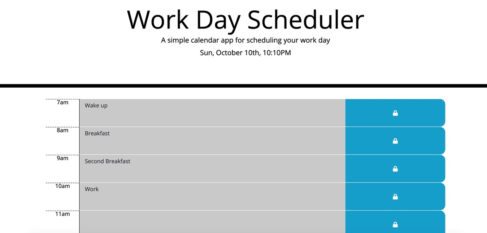

# scheduler

This is a basic work schedule site. The user is able to input text in certain time blocks (between 7a-9p) and come back to their webpage to see that their planner items will still be there.

Initially the frontend elements were constructed and then work began on ensuring the text inputs would push the data to local storage and retrieve it later on.

Screen of final product:
